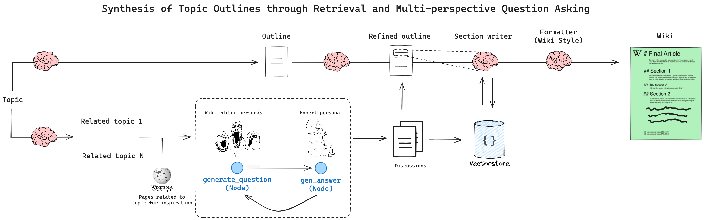

Bukki based on Storm:

# User input Form & UI: (using custom tikinter // streamlit)

>>>> stages progress bar on the top 
- Domain
- Title
- Description
- Style
- Bio
- Word count
- Illustrated? [toggle]
Submit button
---
# On the side, we see a text field with the outline generated, click back, try again,next
---
# Research synthetised data, click back, try again, next.
---
# Chapter One draft & Editable, click back, try again, next.
...
# Last Chapter, click back, try again, next.
---
# Download button, Email field, Send button

# Data Base:
1. Outline - structured output json
2. Research - web crawled data from outline & input -> synthetised factual data context

# Writer Generating the Content:
- traversing the outline json
- using the research data as system context
- using the past written content as context
> writer is equiped with tools: web crawling, image generation.

# Output:
- voicing the article / book ? 
- compiling the full written .md into a pdf with the images generated for each chapter
- sending the pdf to the user email

---
https://langchain-ai.github.io/langgraph/tutorials/storm/storm/
